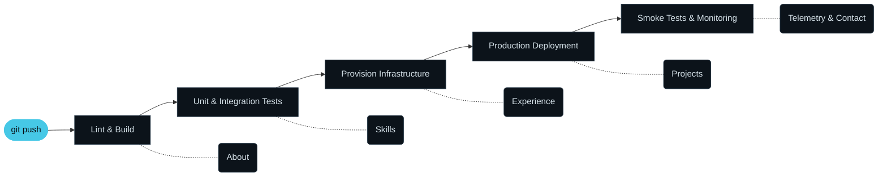

<div align="center">

```
┌─────────────────────────────────────────────────────────────────┐
│  $ git push origin main                                         │
│  remote: webhook fired → pipeline #3023 created for main        │
│  remote: ✓ lint  ✓ test  ✓ provision  ✓ deploy                  │
│  remote: environment/production healthy · replicas 3/3          │
└─────────────────────────────────────────────────────────────────┘
```

# The Autonomous Pipeline

### Tarun Ashwini · DevOps Engineer

**A portfolio that behaves like the systems it describes.**
Scroll the page and you run a deployment. Every section is a pipeline stage.

<br>

[](https://tarunashwini.github.io/portfolio/)

### [tarunashwini.github.io/portfolio](https://tarunashwini.github.io/portfolio/)

<br>


<br>

[](https://tarunashwini.github.io/portfolio/)

<sub>Click the preview to open the live site.</sub>

</div>

<br>

## `$ cat CONCEPT.md`

Most portfolios list tools. This one lets you **operate** them.

The page is a cluster console. A status bar tracks pod health and the current stage. A rail on the left carries a packet through the pipeline as you scroll. Stage gates flip from `[QUEUED]` to `[PASSED]` when you reach them. By the time you hit the contact form, you have shipped a release.



<br>

## `$ kubectl get features`

| Stage | Section | What you can do |
|:--|:--|:--|
| `trigger` | **Hero terminal** | Watch a real-looking `git push` roll out, then type commands yourself |
| `build` | **About** | Read the summary while the first gate passes |
| `test` | **Skills** | 17 skills run as Kubernetes pods. Hover to scale one out. Hit *Simulate chaos* to crash it and watch it self-heal |
| `provision` | **Experience** | Career history drawn as `git log --graph`, with branches and commits |
| `deploy` | **Projects** | Each project arrives as a `terraform plan`, then applies into an isometric infrastructure diagram. Hover to send traffic through it |
| `monitor` | **Telemetry** | Live tenure counter, gauge, and a sparkline of *your own* interactions per second |
| `monitor` | **Alertmanager** | The contact form. Fire an alert and it routes to Gmail or WhatsApp |

There is also a live `tail -f` log that records everything you do on the page.

<br>

## `$ help`

The hero terminal is interactive. Click it and type.

| Command | Alias | Result |
|:--|:--|:--|
| `help` | `ls` | List available commands |
| `whoami` | | Who is running this cluster |
| `kubectl get pods` | `skills` | Print live status of every skill pod |
| `git log` | `experience` | Jump to career history |
| `terraform apply` | `projects` | Jump to projects |
| `cat resume.pdf` | `resume` | Open the résumé |
| `contact` | | Route to Alertmanager |
| `clear` | | Clear the screen |

Arrow keys walk through command history.

> **Psst.** Try `sudo hire-me`.

<br>

## `$ ./run.sh`

The fastest way is to open the hosted version: **https://tarunashwini.github.io/portfolio/**

To run it locally there is no install, no build and no `node_modules`.

```bash
git clone https://github.com/Tarunashwini/portfolio.git
cd portfolio

# pick one
python -m http.server 8000
npx serve .
```

Then open **http://localhost:8000**.

You can also double-click `index.html`. A local server is the better choice because it matches how the site behaves once deployed.

<br>

## `$ terraform apply` <sub>deploying</sub>

The site is live on **GitHub Pages** at https://tarunashwini.github.io/portfolio/.

It is three static files, so any static host works with zero configuration.

| Host | How |
|:--|:--|
| **GitHub Pages** | Settings → Pages → deploy from `main`, root folder |
| **Netlify** | Drag the folder onto the dashboard |
| **Vercel** | Import the repo, leave build settings empty |

<br>

## `$ tree`

```
.
├── index.html           # markup: status bar, rail, six sections, stage gates
├── styles.css           # single dark theme, responsive, reduced-motion aware
├── app.js               # everything interactive, one IIFE, no dependencies
├── Tarun_Ashwini.pdf    # résumé
└── docs/
    └── preview.png      # screenshot used in this README
```

<br>

## `$ vim config`

Everything you are likely to change lives in two places.

**Contact targets** sit at the top of `app.js`:

```js
const EMAIL    = 'tarun.aashwini@gmail.com';
const WHATSAPP = '917674012022';   // country code + number, digits only
```

**Theme colours** are CSS variables at the top of `styles.css`:

```css
--ink:    #070B10;   /* background  */
--accent: #46C8E6;   /* cyan        */
--ok:     #4ADE95;   /* healthy     */
--warn:   #F2B544;   /* pending     */
--err:    #FF6A6A;   /* firing      */
```

Skills and projects are plain data arrays in `app.js`, named `POOLS` and `PROJECTS`. Edit the arrays and the pods and diagrams rebuild themselves.

<br>

## `$ cat DESIGN_NOTES.md`

- **Zero dependencies.** No framework, no bundler, no CDN scripts. Only web fonts are loaded from outside.
- **Accessible motion.** Every animation respects `prefers-reduced-motion`.
- **Responsive.** Layouts collapse cleanly from wide desktop down to phones.
- **Honest contact form.** It opens a prefilled Gmail draft or WhatsApp chat, and the visitor presses send. Nothing is sent silently.
- **IST clock.** The status bar shows Hyderabad time to every visitor, wherever they are.
- **Typography.** Martian Mono for display, JetBrains Mono for code, IBM Plex Sans for reading.

<br>

## `$ alertmanager --receivers`

<div align="center">

[](mailto:tarun.aashwini@gmail.com)
[](https://www.linkedin.com/in/tarun-ashwini-75b8b4195/)
[](https://github.com/Tarunashwini)
[](https://wa.me/917674012022)

<br>

```
deployed from main · all stages passed · uptime 99.99%
https://tarunashwini.github.io/portfolio/
```

<sub>© 2026 Tarun Ashwini</sub>

</div>
